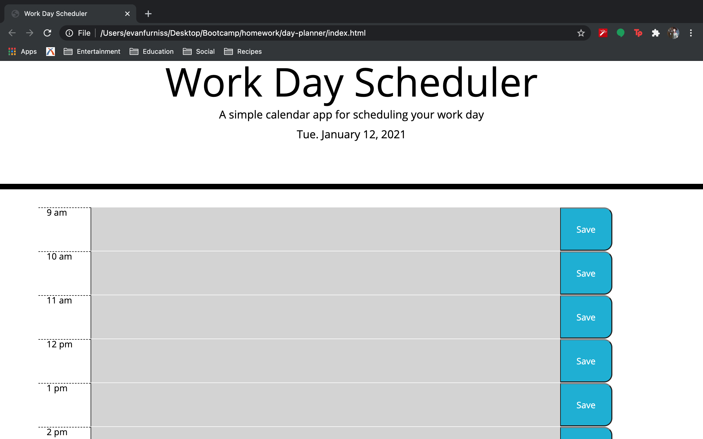
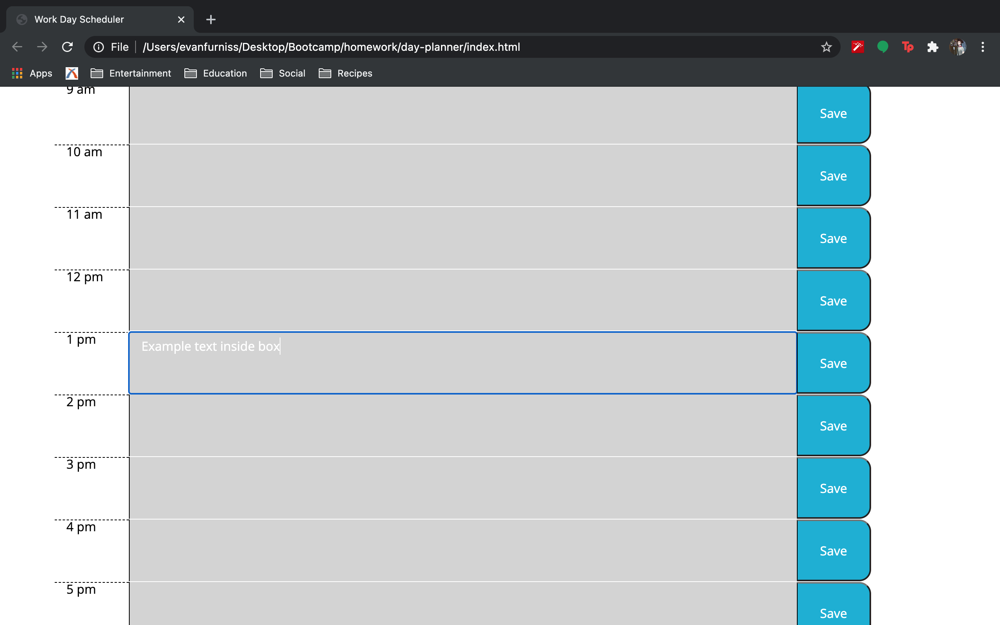
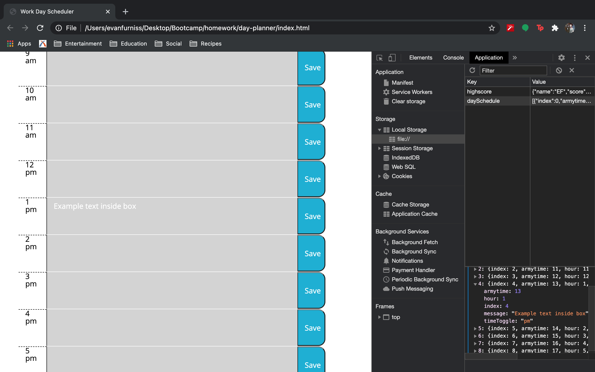

# Day Planner

## Links

GitHub repository: https://github.com/evanfurniss/day-planner

GitHub live site: https://evanfurniss.github.io/day-planner/

## Overview

This project helped solidify my understanding of JQuery and the benefits of using JQuery while manipulation the HTML DOM. Using a predetermined array representative of a users work day, the user will see a header including the day, month, and year. Below, the user will see a number of rows, each labeled to reprent one hour of the users work day. For each hour, a text box is created where the user can set reminders, appointments, deadlines, etc. for the current day. Each hour also has a save button at the end of the row. When the button is clicked, the users message data will be stored in local storage. If the page closes, the user should still be able to see the data they input in the message area of that specific hour. The save button will only capture the message within that specific hour. If multiple reminders were created, the user will need to go through and save for each hour.

I decided to use several technologies that we have only just began to talk about, but have worked really well in the creation of this assignment. Below is a list of the technologies utilized in the creation of this site:

* forEach(): this function operates similar to a for loop but can only traverse arrays (or so the internet has lead me to believe) without the need of a counter (ex. i). I like the idea of being able to point to my array object without having to indicate which index value I am on, especially since I kept my hours schedule in an array of objects.

* localStorage: I understand localStorage quite a bit better than I have in previous projects. Using JSON parse my get or stringify my set were confusing. This cleared that up quite a bit. I still have more personal understanding to overcome, but I get the gist.

* this: the elusive 'this' keyword that was all too confusing when I first began coding, now makes sense. To use 'this', a user must have something specific to point to; an event, an object, or the window. Within an object or function, you can use 'this' to save time if you need to point to that specific object or function.

* JQuery: Last but not least, JQuery. I had a hard time understand how the JQuery was supposed to help us navigate our HTML DOM. But it makes sense now. Are you targeting a class/id/html tag? Are you tring to create a specific html tag? Just use JavaScript shorthand (JQuery) to target that element. Plus the shorthand function calls have been nice.

## Assets

w3schools has, once again, been incredibly helpful. They are able to explain so many ideas, functions, logic that no where on the internet (maybe with the exception of mozilla) has as much in depth and concise information, and examples on how that particular technology is used in web development. 

## Images/Examples

